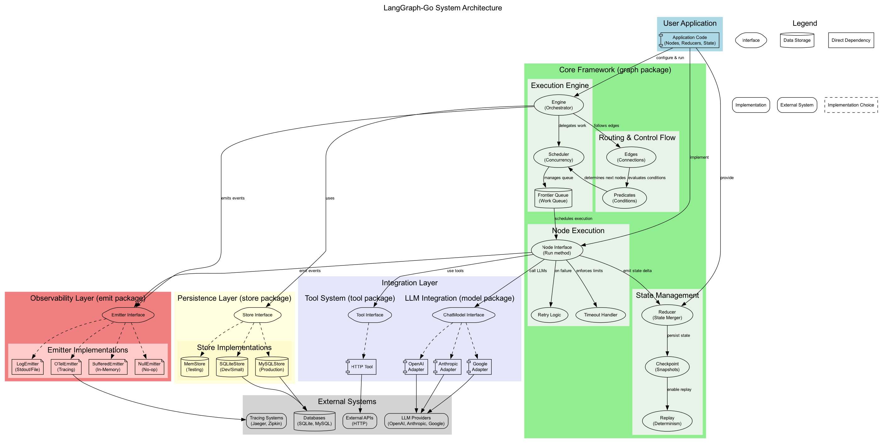
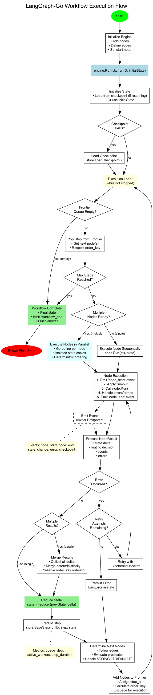
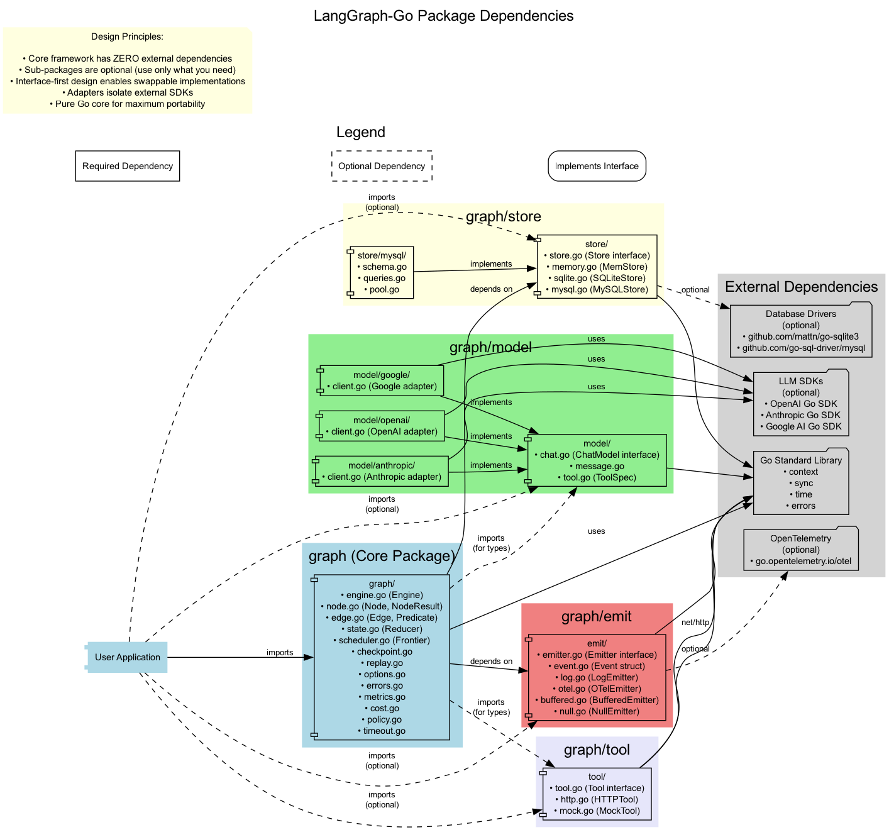

# LangGraph-Go Architecture Documentation

This directory contains comprehensive architecture diagrams for the LangGraph-Go framework, visualizing the system design, component relationships, and execution flows.

## Diagrams

### 1. System Architecture (`system-architecture.png`)

**Purpose**: High-level overview of all system components and their relationships.

**Covers**:
- **User Application Layer**: How applications interact with the framework
- **Core Framework Layer**:
  - Execution Engine (Engine, Scheduler, Frontier Queue)
  - State Management (Reducer, Checkpoint, Replay)
  - Routing & Control Flow (Edges, Predicates)
  - Node Execution (Timeout, Retry)
- **Persistence Layer**: Store interface and implementations (Memory, SQLite, MySQL)
- **Observability Layer**: Emitter interface and implementations (Log, OpenTelemetry, Buffered, Null)
- **Integration Layer**:
  - LLM Integration (OpenAI, Anthropic, Google adapters)
  - Tool System (HTTP tools, custom tools)
- **External Systems**: LLM providers, databases, tracing systems, APIs

**Key Insights**:
- Interface-first design with pluggable implementations
- Clear separation of concerns across layers
- Optional adapters for external dependencies
- Pure Go core with minimal dependencies



---

### 2. Workflow Execution Flow (`workflow-execution.png`)

**Purpose**: Detailed flowchart of workflow execution from start to finish.

**Covers**:
- **Initialization**: Engine setup, node registration, edge definition
- **State Management**: Initial state, checkpoint loading, state reduction
- **Execution Loop**:
  - Frontier queue processing
  - Sequential vs parallel execution decision
  - Node execution with timeout and retry
  - Error handling and recovery
- **Result Processing**:
  - State delta reduction
  - Result merging (for parallel execution)
  - Step persistence
- **Routing**: Edge following, predicate evaluation, next node selection
- **Completion**: Final state return, event flushing

**Key Insights**:
- Deterministic execution with replayability
- Concurrent execution with ordered result merging
- Comprehensive error handling and retry logic
- Event emission at every stage for observability
- Max steps protection against infinite loops



---

### 3. Package Dependencies (`package-dependencies.png`)

**Purpose**: Package structure and dependency relationships.

**Covers**:
- **External Dependencies**:
  - Go Standard Library (required)
  - OpenTelemetry SDK (optional)
  - LLM SDKs (optional - OpenAI, Anthropic, Google)
  - Database Drivers (optional - SQLite, MySQL)
- **Core Package** (`graph`): Engine, Node, Edge, State, Scheduler
- **Sub-packages**:
  - `graph/emit`: Event emission and observability
  - `graph/store`: Persistence layer
  - `graph/model`: LLM integration
  - `graph/tool`: Tool system
- **User Application**: How applications import and use the framework

**Key Insights**:
- **Zero external dependencies** in core framework
- Sub-packages are **completely optional** (use only what you need)
- **Interface-first design** enables swappable implementations
- **Adapters isolate** external SDK dependencies
- Pure Go core for **maximum portability**



---

## Source Files

All diagrams are generated from DOT (GraphViz) source files:

- `system-architecture.dot` - System architecture diagram source
- `workflow-execution.dot` - Workflow execution flow source
- `package-dependencies.dot` - Package dependency diagram source

## Viewing Diagrams

### View PNG Files

Open the PNG files directly in any image viewer:

```bash
# macOS
open docs/architecture/system-architecture.png
open docs/architecture/workflow-execution.png
open docs/architecture/package-dependencies.png

# Linux
xdg-open docs/architecture/*.png

# Windows
start docs/architecture/*.png
```

### View in Browser

For interactive viewing with zoom:

```bash
# Serve the docs directory
cd docs/architecture
python3 -m http.server 8080

# Open http://localhost:8080 in your browser
```

## Regenerating Diagrams

If you modify the DOT files, regenerate the PNG images:

### Prerequisites

Install GraphViz:

```bash
# macOS
brew install graphviz

# Ubuntu/Debian
sudo apt-get install graphviz

# Fedora/RHEL
sudo dnf install graphviz

# Windows (Chocolatey)
choco install graphviz

# Windows (Scoop)
scoop install graphviz
```

### Render to PNG

```bash
cd docs/architecture

# Render all diagrams
dot -Tpng system-architecture.dot -o system-architecture.png
dot -Tpng workflow-execution.dot -o workflow-execution.png
dot -Tpng package-dependencies.dot -o package-dependencies.png

# Or use the Makefile
make diagrams
```

### Alternative Formats

GraphViz supports multiple output formats:

```bash
# SVG (scalable vector graphics)
dot -Tsvg system-architecture.dot -o system-architecture.svg

# PDF (portable document format)
dot -Tpdf system-architecture.dot -o system-architecture.pdf

# Interactive HTML
dot -Tsvg:cairo system-architecture.dot | dot -Thtml > system-architecture.html
```

## Online Tools

If you don't have GraphViz installed, use online renderers:

1. **GraphvizOnline**: https://dreampuf.github.io/GraphvizOnline/
   - Paste DOT source directly
   - Real-time preview
   - Export to PNG/SVG

2. **Edotor**: https://edotor.net/
   - Online GraphViz editor
   - Syntax highlighting
   - Download in multiple formats

3. **Viz.js**: https://viz-js.com/
   - JavaScript-based renderer
   - Works offline after loading
   - Export capabilities

## Design Principles

These diagrams illustrate key LangGraph-Go design principles:

### 1. **Interface-First Design**
All major abstractions (`Node`, `Store`, `Emitter`, `ChatModel`, `Tool`) are defined as interfaces before implementation. This enables:
- Testability with mocks
- Multiple implementations (in-memory vs production)
- Isolation of external dependencies

### 2. **Dependency Minimalism**
The core framework has **zero external dependencies** (pure Go stdlib). Optional integrations are isolated in adapter packages.

### 3. **Type Safety & Determinism**
Strongly-typed state management using Go generics ensures:
- Compile-time type safety
- Deterministic replay from checkpoints
- Pure reducer functions for state transitions

### 4. **Observability by Default**
Events are emitted at every execution stage:
- Node start/end
- State transitions
- Errors and warnings
- Checkpoint operations
- Routing decisions

### 5. **Concurrent Execution with Determinism**
Parallel node execution with:
- Isolated state copies per branch
- Deterministic result ordering
- Replayable execution logs

## Architecture Evolution

The current architecture (v1.0) represents a mature, production-ready design. Future enhancements may include:

- **Streaming Support**: Real-time state streaming for long-running workflows
- **Distributed Execution**: Multi-node workflow execution across machines
- **Visual Workflow Editor**: Web-based graph editor with live preview
- **Advanced Routing**: Circuit breaker, bulkhead, and adaptive retry strategies
- **GraphQL API**: Introspection API for workflow inspection and control

## Related Documentation

- [CLAUDE.md](../../CLAUDE.md) - Development guidance and architecture overview
- [docs/godoc/](../godoc/) - Generated API documentation
- [docs/concurrency.md](../concurrency.md) - Concurrency model deep-dive
- [docs/determinism-guarantees.md](../determinism-guarantees.md) - Formal determinism contracts
- [docs/store-guarantees.md](../store-guarantees.md) - Exactly-once semantics

## Contributing

To update architecture diagrams:

1. Modify the DOT source files
2. Regenerate PNG images with `dot` command
3. Update this README if new diagrams are added
4. Commit both DOT source and rendered PNG files

## Generated

- **Date**: 2025-11-08
- **Tool**: GraphViz 14.0.2
- **Format**: DOT → PNG (via `dot -Tpng`)
- **Task**: T202 (Architecture Diagram)
