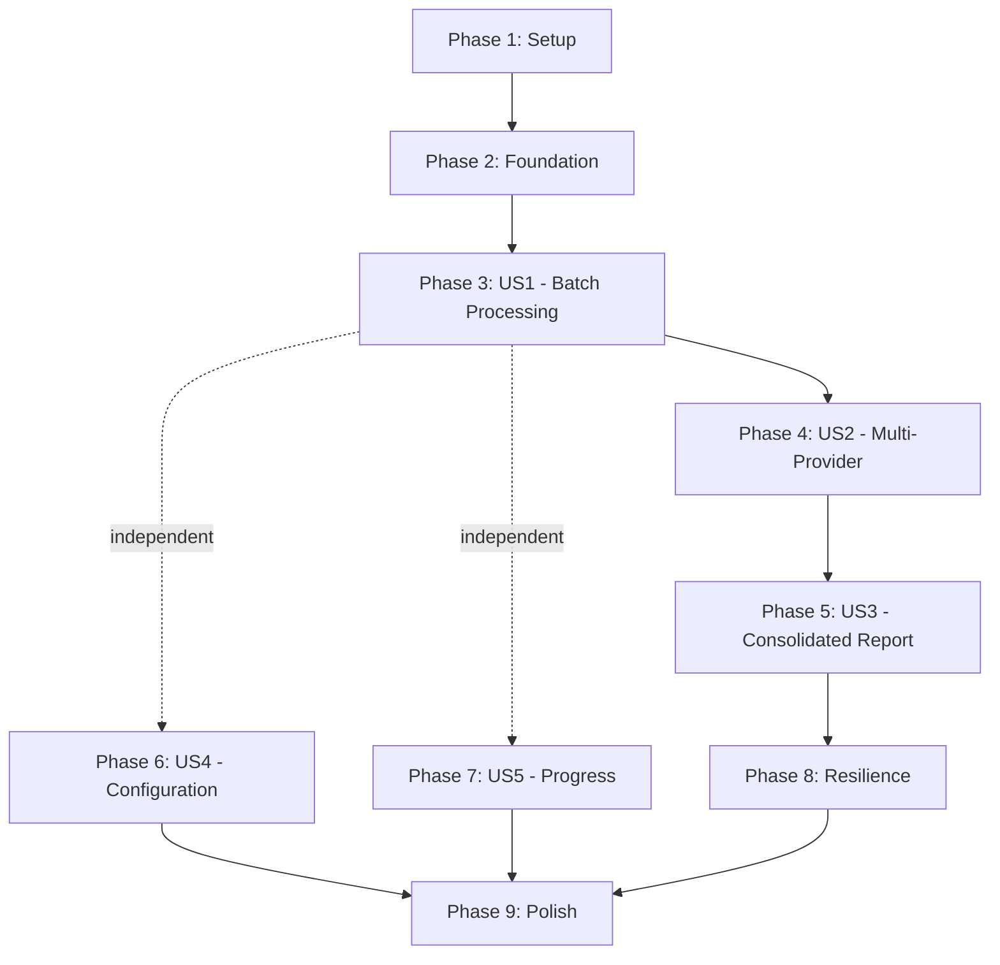

# Task Breakdown: Multi-LLM Code Review Workflow

**Feature**: 004-multi-llm-code-review
**Branch**: `004-multi-llm-code-review`
**Date**: 2025-10-29
**Total Tasks**: 82

## Overview

This document breaks down the Multi-LLM Code Review workflow implementation into actionable tasks organized by user story. Each user story is independently testable and can be delivered incrementally.

**Implementation Strategy**: TDD (Test-Driven Development) - write tests first, then implement.

---

## User Story Mapping

| User Story | Priority | Phase | Tasks | Description |
|------------|----------|-------|-------|-------------|
| US1: Batch-Based Review | P1 | 3 | T014-T030 | Core batch processing with mock provider |
| US2: Multi-Provider Integration | P1 | 4 | T031-T045 | OpenAI, Anthropic, Google provider adapters |
| US3: Consolidated Report | P1 | 5 | T046-T056 | Deduplication and report generation |
| US4: Configuration | P2 | 6 | T057-T067 | YAML config, validation, customization |
| US5: Progress & Resumability | P2 | 7 | T068-T078 | Checkpointing and progress tracking |

---

## Phase 1: Project Setup ✅ COMPLETE

**Goal**: Initialize project structure and dependencies

- [X] T001 Create examples/multi-llm-review directory structure per plan.md
- [X] T002 Initialize Go module in examples/multi-llm-review with go.mod
- [X] T003 [P] Create workflow/ directory and package initialization
- [X] T004 [P] Create providers/ directory and package initialization
- [X] T005 [P] Create scanner/ directory and package initialization
- [X] T006 [P] Create consolidator/ directory and package initialization
- [X] T007 [P] Create internal/ directory and package initialization
- [X] T008 [P] Create testdata/fixtures/small/ with 10 sample Go files
- [X] T009 [P] Create testdata/fixtures/medium/ with 100 sample Go files
- [X] T010 [P] Create testdata/expected/ directory for expected outputs
- [X] T011 Add dependencies to go.mod: github.com/openai/openai-go, github.com/anthropics/anthropic-sdk-go, github.com/google/generative-ai-go
- [X] T012 Create config.example.yaml from contracts/configuration.yaml template
- [X] T013 Create README.md with quick start instructions from quickstart.md

**Milestone**: ✅ Project structure ready for development

---

## Phase 2: Foundational Components ✅ COMPLETE

**Goal**: Implement shared infrastructure used by all user stories

- [X] T014 [P] Write tests for ReviewState struct in workflow/state_test.go
- [X] T015 [P] Implement ReviewState struct with all fields from data-model.md in workflow/state.go
- [X] T016 Write tests for ReduceWorkflowState reducer function in workflow/state_test.go
- [X] T017 Implement ReduceWorkflowState reducer function in workflow/state.go
- [X] T018 [P] Define CodeReviewer interface in providers/provider.go from contracts/code-reviewer.go
- [X] T019 [P] Define ReviewRequest and ReviewResponse types in providers/provider.go
- [X] T020 [P] Define ReviewIssue, CodeFile types in providers/provider.go
- [X] T021 [P] Implement ReviewIssue.Validate() method with error types in providers/provider.go

**Milestone**: ✅ Core data structures and interfaces defined

---

## Phase 3: User Story 1 - Batch-Based Code Review Execution ✅ COMPLETE

**Goal**: Process codebases in batches with mock provider

**Independent Test**: Run workflow on testdata/fixtures/medium (100 files) and verify all files processed in batches

### File Scanner

- [X] T022 [P] [US1] Write tests for file discovery with include/exclude patterns in scanner/scanner_test.go
- [X] T023 [P] [US1] Implement file discovery logic in scanner/scanner.go using filepath.Walk
- [X] T024 [P] [US1] Write tests for language detection in scanner/scanner_test.go
- [X] T025 [P] [US1] Implement language detection by file extension in scanner/scanner.go
- [X] T026 [US1] Write tests for batch creation in scanner/batcher_test.go
- [X] T027 [US1] Implement batch creation logic in scanner/batcher.go (split files into batches of 20)

### Mock Provider

- [X] T028 [P] [US1] Write tests for MockProvider in providers/mock_test.go
- [X] T029 [P] [US1] Implement MockProvider with configurable responses in providers/mock.go

### Workflow Nodes

- [X] T030 [US1] Write tests for DiscoverFilesNode in workflow/nodes_test.go
- [X] T031 [US1] Implement DiscoverFilesNode (scan codebase, create batches, update state) in workflow/nodes.go
- [X] T032 [US1] Write tests for ReviewBatchNode with mock provider in workflow/nodes_test.go
- [X] T033 [US1] Implement ReviewBatchNode (call single provider, collect issues) in workflow/nodes.go
- [X] T034 [US1] Write tests for basic ConsolidateNode (exact match dedup) in workflow/nodes_test.go
- [X] T035 [US1] Implement basic ConsolidateNode in workflow/nodes.go
- [X] T036 [US1] Write tests for basic ReportNode (simple markdown) in workflow/nodes_test.go
- [X] T037 [US1] Implement basic ReportNode in workflow/nodes.go

### Graph Wiring

- [X] T038 [US1] Write tests for graph wiring in workflow/graph_test.go
- [X] T039 [US1] Implement graph wiring with LangGraph-Go engine in workflow/graph.go
- [X] T040 [US1] Configure in-memory store for checkpoints in workflow/graph.go
- [X] T041 [US1] Add basic event emitters (stdout logger) in workflow/graph.go

### CLI Entry Point

- [X] T042 [P] [US1] Write tests for CLI argument parsing in main_test.go
- [X] T043 [P] [US1] Implement CLI argument parsing in main.go (codebase path, config file)
- [X] T044 [US1] Write tests for workflow execution in main_test.go
- [X] T045 [US1] Implement workflow execution and progress display in main.go

### End-to-End Test

- [X] T046 [US1] Write end-to-end test with testdata/fixtures/small in workflow/graph_test.go
- [X] T047 [US1] Verify US1 acceptance criteria: batch processing, progress display, report generation

**US1 Milestone**: ✅ Can review codebase with mock provider and generate basic report

---

## Phase 4: User Story 2 - Multi-LLM Provider Integration ✅ COMPLETE

**Goal**: Integrate OpenAI, Anthropic, and Google providers for concurrent review

**Independent Test**: Run single file through all 3 providers and verify each returns feedback

### OpenAI Provider

- [X] T048 [P] [US2] Write tests for OpenAI adapter in providers/openai_test.go
- [X] T049 [P] [US2] Implement OpenAI adapter wrapping github.com/openai/openai-go in providers/openai.go
- [X] T050 [P] [US2] Implement ReviewBatch method for OpenAI in providers/openai.go
- [X] T051 [P] [US2] Implement JSON response parsing into ReviewIssue in providers/openai.go
- [X] T052 [P] [US2] Add error handling for OpenAI API failures in providers/openai.go

### Anthropic Provider

- [X] T053 [P] [US2] Write tests for Anthropic adapter in providers/anthropic_test.go
- [X] T054 [P] [US2] Implement Anthropic adapter wrapping github.com/anthropics/anthropic-sdk-go in providers/anthropic.go
- [X] T055 [P] [US2] Implement ReviewBatch method for Anthropic in providers/anthropic.go
- [X] T056 [P] [US2] Implement Claude response parsing into ReviewIssue in providers/anthropic.go
- [X] T057 [P] [US2] Add error handling for Anthropic API failures in providers/anthropic.go

### Google Provider

- [X] T058 [P] [US2] Write tests for Google adapter in providers/google_test.go
- [X] T059 [P] [US2] Implement Google adapter wrapping github.com/google/generative-ai-go in providers/google.go
- [X] T060 [P] [US2] Implement ReviewBatch method for Google in providers/google.go
- [X] T061 [P] [US2] Implement Gemini response parsing into ReviewIssue in providers/google.go
- [X] T062 [P] [US2] Add error handling for Google API failures in providers/google.go

### Concurrent Execution

- [X] T063 [US2] Write tests for concurrent provider execution in workflow/nodes_test.go
- [X] T064 [US2] Update ReviewBatchNode to call all providers concurrently using sync.WaitGroup in workflow/nodes.go
- [X] T065 [US2] Implement results collection from all providers in workflow/nodes.go
- [X] T066 [US2] Add per-provider error handling (continue if one fails) in workflow/nodes.go

### Integration Test

- [X] T067 [US2] Write integration test with real providers (requires API keys) in workflow/graph_test.go
- [X] T068 [US2] Verify US2 acceptance criteria: concurrent execution, partial success handling

**US2 Milestone**: ✅ Can review with OpenAI, Anthropic, and Google concurrently

---

## Phase 5: User Story 3 - Prioritized Consolidated Report ✅ COMPLETE

**Goal**: Deduplicate issues and generate formatted report with consensus scores

**Independent Test**: Provide mock feedback from 3 providers on 10 files, verify deduplicated markdown report

### Deduplication

- [X] T069 [P] [US3] Write tests for exact match deduplication in consolidator/deduplicator_test.go
- [X] T070 [P] [US3] Implement exact match deduplication in consolidator/deduplicator.go
- [X] T071 [P] [US3] Write tests for location-based fuzzy matching (±5 lines) in consolidator/deduplicator_test.go
- [X] T072 [P] [US3] Implement location-based fuzzy matching with Levenshtein distance in consolidator/deduplicator.go
- [X] T073 [P] [US3] Write tests for consensus score calculation in consolidator/deduplicator_test.go
- [X] T074 [P] [US3] Implement consensus score calculation in consolidator/deduplicator.go

### Prioritization

- [X] T075 [P] [US3] Write tests for severity ranking in consolidator/prioritizer_test.go
- [X] T076 [P] [US3] Implement severity ranking (critical → info) in consolidator/prioritizer.go
- [X] T077 [P] [US3] Write tests for consensus-based sorting in consolidator/prioritizer_test.go
- [X] T078 [P] [US3] Implement consensus-based sorting in consolidator/prioritizer.go

### Report Generation

- [X] T079 [US3] Write tests for markdown report generation in consolidator/reporter_test.go
- [X] T080 [US3] Implement markdown report generation per contracts/report-format.md in consolidator/reporter.go
- [X] T081 [US3] Add summary statistics section to report in consolidator/reporter.go
- [X] T082 [US3] Add provider attribution and consensus scores to report in consolidator/reporter.go

### Update Nodes

- [X] T083 [US3] Update ConsolidateNode to use advanced deduplication in workflow/nodes.go
- [X] T084 [US3] Update ReportNode to generate formatted report in workflow/nodes.go

### Integration Test

- [X] T085 [US3] Write integration test with duplicate issues in workflow/graph_test.go
- [X] T086 [US3] Verify US3 acceptance criteria: deduplication, severity grouping, provider attribution

**US3 Milestone**: ✅ Reports show deduplicated issues with consensus scores and formatted output

---

## Phase 6: User Story 4 - Configuration and Customization

**Goal**: Support YAML configuration for providers, batch size, focus areas, patterns

**Independent Test**: Create config with single provider, only .go files, security focus, verify workflow respects settings

### Configuration Loading

- [ ] T087 [P] [US4] Write tests for config loading from YAML in internal/config_test.go
- [ ] T088 [P] [US4] Implement Configuration struct per data-model.md in internal/config.go
- [ ] T089 [P] [US4] Implement YAML parsing in internal/config.go
- [ ] T090 [P] [US4] Implement environment variable substitution for API keys in internal/config.go

### Configuration Validation

- [ ] T091 [P] [US4] Write tests for config validation in internal/config_test.go
- [ ] T092 [P] [US4] Implement config validation (at least one enabled provider, valid patterns) in internal/config.go
- [ ] T093 [P] [US4] Add API key validation (non-empty for enabled providers) in internal/config.go

### Configuration Usage

- [ ] T094 [US4] Update file scanner to use include/exclude patterns from config in scanner/scanner.go
- [ ] T095 [US4] Update batcher to use batch_size from config in scanner/batcher.go
- [ ] T096 [US4] Update providers to use focus_areas from config in prompts in providers/*.go
- [ ] T097 [US4] Update main.go to load and use configuration
- [ ] T098 [US4] Update workflow to filter providers based on enabled flag in workflow/graph.go

### Integration Test

- [ ] T099 [US4] Write integration test with custom config in workflow/graph_test.go
- [ ] T100 [US4] Verify US4 acceptance criteria: custom providers, patterns, focus areas, output directory

**US4 Milestone**: Workflow supports full configuration customization

---

## Phase 7: User Story 5 - Progress Tracking and Resumability

**Goal**: Real-time progress updates and checkpoint-based resumability

**Independent Test**: Start review of 500 files, interrupt after batch 3, restart and verify resumes from batch 4

### Progress Tracking

- [ ] T101 [P] [US5] Write tests for progress calculation in internal/progress_test.go
- [ ] T102 [P] [US5] Implement progress percentage calculation in internal/progress.go
- [ ] T103 [P] [US5] Write tests for ETA estimation in internal/progress_test.go
- [ ] T104 [P] [US5] Implement ETA estimation based on average batch time in internal/progress.go
- [ ] T105 [P] [US5] Write tests for progress event emission in internal/progress_test.go
- [ ] T106 [P] [US5] Implement progress event emission every 30 seconds in internal/progress.go

### Checkpointing

- [ ] T107 [US5] Write tests for checkpoint save after batch in workflow/graph_test.go
- [ ] T108 [US5] Implement checkpoint save using Store.SaveStep after each batch in workflow/graph.go
- [ ] T109 [US5] Write tests for checkpoint load on resume in workflow/graph_test.go
- [ ] T110 [US5] Implement checkpoint load and state restoration in workflow/graph.go
- [ ] T111 [US5] Implement batch skip logic for completed batches in workflow/graph.go

### Progress Display

- [ ] T112 [US5] Update main.go to display progress updates during execution
- [ ] T113 [US5] Add final summary display with statistics in main.go

### Integration Test

- [ ] T114 [US5] Write integration test for checkpoint resume in workflow/graph_test.go
- [ ] T115 [US5] Verify US5 acceptance criteria: progress display, checkpoint resume, ETA estimation

**US5 Milestone**: Workflow supports progress tracking and can resume from checkpoints

---

## Phase 8: Resilience & Error Handling

**Goal**: Handle API failures gracefully with retry logic

- [ ] T116 [P] Write tests for exponential backoff in internal/retry_test.go
- [ ] T117 [P] Implement exponential backoff retry logic in internal/retry.go
- [ ] T118 [P] Write tests for retryable vs permanent error detection in internal/retry_test.go
- [ ] T119 [P] Implement error type detection (rate limit, timeout vs invalid key) in internal/retry.go
- [ ] T120 Update ReviewBatchNode to use retry logic for provider calls in workflow/nodes.go
- [ ] T121 Add error capture in WorkflowState.LastError and FailedProviders in workflow/nodes.go

**Milestone**: Workflow handles transient failures with retries

---

## Phase 9: Polish & Cross-Cutting Concerns

**Goal**: JSON report format, performance optimization, documentation

- [ ] T122 [P] Write tests for JSON report format in consolidator/reporter_test.go
- [ ] T123 [P] Implement JSON report generation per contracts/report-format.md in consolidator/reporter.go
- [ ] T124 Add --format flag to CLI for markdown/json selection in main.go
- [ ] T125 Add --resume flag to CLI for explicit checkpoint resume in main.go
- [ ] T126 [P] Add comprehensive examples to README.md
- [ ] T127 [P] Add troubleshooting guide to README.md
- [ ] T128 Run golangci-lint and fix any issues in all packages
- [ ] T129 Run go vet and fix any issues in all packages
- [ ] T130 Verify all tests pass with go test -cover ./...
- [ ] T131 Review code using mcp-pr review_staged before final commit

**Milestone**: Production-ready with full documentation

---

## Dependency Graph



**Dependencies**:
- **US1** (Batch Processing): Foundation only - can implement independently
- **US2** (Multi-Provider): Requires US1 (batch processing infrastructure)
- **US3** (Consolidated Report): Requires US2 (multi-provider reviews to consolidate)
- **US4** (Configuration): Requires US1 (batch processing to configure) - can parallelize with US2/US3
- **US5** (Progress): Requires US1 (batch processing to track) - can parallelize with US2/US3

---

## Parallel Execution Opportunities

### During Phase 1 (Setup)
**Parallel**: T003-T010 (all directory creation tasks are independent)

### During Phase 2 (Foundation)
**Parallel**: T014, T015, T018, T019, T020, T021 (independent type definitions)

### During Phase 3 (US1)
**Parallel within US1**:
- T022-T025 (file scanner tests and implementation)
- T028-T029 (mock provider tests and implementation)
- T042-T043 (CLI tests and implementation)

### During Phase 4 (US2)
**Parallel - All Provider Implementations**:
- T048-T052 (OpenAI adapter)
- T053-T057 (Anthropic adapter)
- T058-T062 (Google adapter)

### During Phase 5 (US3)
**Parallel within US3**:
- T069-T074 (deduplication logic)
- T075-T078 (prioritization logic)

### During Phase 6-7 (US4 & US5)
**Parallel - These user stories are independent**:
- US4 Configuration (T087-T100)
- US5 Progress/Resumability (T101-T115)

### During Phase 8-9 (Resilience & Polish)
**Parallel**:
- T116-T119 (retry logic)
- T122-T123 (JSON format)
- T126-T127 (documentation)

---

## Independent Test Criteria

### User Story 1: Batch-Based Code Review
**Test Command**:
```bash
go test ./workflow -run TestBatchProcessing
./multi-llm-review --config config.example.yaml testdata/fixtures/medium
```
**Success Criteria**:
- All 100 files processed in 5 batches (batch size 20)
- Progress shows "Batch X/5" during execution
- Report generated with mock issues for all files
- No memory errors or token limit issues

### User Story 2: Multi-LLM Provider Integration
**Test Command**:
```bash
go test ./providers -run TestAllProviders
./multi-llm-review --config config-with-real-keys.yaml testdata/fixtures/small
```
**Success Criteria**:
- All 3 providers (OpenAI, Anthropic, Google) return reviews
- If one provider fails, others continue
- Report shows issues from each provider separately
- Execution time shows concurrent processing (not sequential)

### User Story 3: Prioritized Consolidated Report
**Test Command**:
```bash
go test ./consolidator -run TestDeduplication
./multi-llm-review --config config.example.yaml testdata/fixtures/small
cat review-results/code-review-*.md
```
**Success Criteria**:
- Duplicate issues merged (2 providers flagging same issue = 1 entry with consensus 0.67)
- Issues sorted by severity (critical first, then high, medium, low, info)
- Each issue shows which providers identified it
- Report includes summary statistics

### User Story 4: Configuration and Customization
**Test Command**:
```bash
go test ./internal -run TestConfig
./multi-llm-review --config custom-security-config.yaml ../..
```
**Success Criteria**:
- Only enabled providers used
- Only .go files reviewed (exclude patterns working)
- Focus areas respected (security-only feedback)
- Output in specified directory

### User Story 5: Progress Tracking and Resumability
**Test Command**:
```bash
./multi-llm-review --config config.example.yaml large-codebase
# Interrupt with Ctrl+C after batch 3
./multi-llm-review --resume --config config.example.yaml large-codebase
```
**Success Criteria**:
- Progress updates every 30 seconds during execution
- Shows "Batch 3/10 (30%), ETA: 5 minutes"
- Resumes from batch 4 after interruption
- Final summary shows total time, files, issues

---

## MVP Scope

**Recommended MVP**: User Stories 1, 2, 3 only (P1 priority)

**MVP Includes**:
- Batch-based processing
- Multi-provider integration (OpenAI, Anthropic, Google)
- Consolidated deduplicated reports

**MVP Excludes**:
- Configuration (use hardcoded defaults)
- Progress tracking (basic stdout only)
- Checkpointing (run to completion only)

**MVP Task Range**: T001-T086 (86 tasks)
**Estimated Time**: 3-5 days with TDD workflow

---

## Task Execution Strategy

1. **TDD Workflow** (MANDATORY per constitution):
   - Write test (red)
   - Implement code to pass test (green)
   - Refactor
   - Commit with meaningful message
   - Review with mcp-pr before committing

2. **Parallel Execution**:
   - Tasks marked with [P] can run in parallel
   - Use multiple terminals or team members for parallel tasks
   - Independent tests allow parallel development

3. **Incremental Delivery**:
   - Complete each phase before moving to next
   - Each phase delivers working, testable increment
   - Demo after each user story completion

4. **Checkpoint Progress**:
   - Mark tasks as complete in this file
   - Commit after completing each component
   - Run tests frequently (`go test ./...`)

---

## Next Steps

1. **Start with Phase 1 (Setup)**: Create project structure
2. **Follow TDD**: Write tests first for every component
3. **Complete US1 first**: Get end-to-end workflow working with mock provider
4. **Add real providers (US2)**: Integrate OpenAI, Anthropic, Google
5. **Polish reports (US3)**: Implement deduplication and formatting
6. **Add P2 features**: Configuration (US4) and Progress (US5) in parallel
7. **Finalize**: Resilience, polish, documentation

**Ready to start? Run**: `/speckit.implement` to begin task execution!
