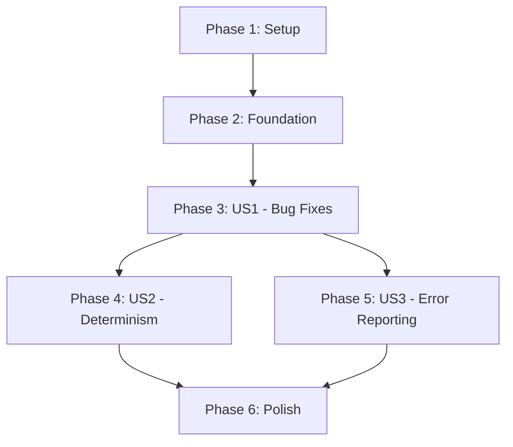

# Tasks: Critical Concurrency Bug Fixes

**Input**: Design documents from `/specs/005-critical-bug-fixes/`  
**Prerequisites**: plan.md, spec.md, research.md

**Tests**: Tests are critical for this feature - validating race conditions, determinism, and performance.

**Organization**: Tasks are grouped by user story (3 stories, P1-P2 priorities) to enable independent implementation and testing.

## Format: `[ID] [P?] [Story] Description`

- **[P]**: Can run in parallel (different files, no dependencies)
- **[Story]**: Which user story this task belongs to (US1, US2, US3)
- Include exact file paths in descriptions

## Path Conventions

This project follows Go standard layout:
- `graph/` - Core graph execution engine
- `graph/` test files - `*_test.go` files alongside implementation

---

## Phase 1: Setup (Shared Infrastructure)

**Purpose**: Establish baseline and testing infrastructure

- [ ] T001 Run baseline performance benchmarks for concurrent execution in graph/engine_test.go
- [ ] T002 Capture baseline race detector results with `go test -race ./graph/...`
- [ ] T003 Document current behavior for regression testing

---

## Phase 2: Foundational (Blocking Prerequisites)

**Purpose**: Core infrastructure that MUST be complete before ANY user story can be implemented

**⚠️ CRITICAL**: No user story work can begin until this phase is complete

- [ ] T004 [P] Create test helper for concurrent workflow execution in graph/concurrency_test.go
- [ ] T005 [P] Create test helper for determinism validation (run workflow N times, compare outputs) in graph/concurrency_test.go
- [ ] T006 [P] Create stress test framework (100+ workers, rapid execution) in graph/stress_test.go

**Checkpoint**: Foundation ready - user story implementation can now begin in parallel

---

## Phase 3: User Story 1 - Reliable Workflow Execution (P1)

**Goal**: Fix all 4 critical concurrency bugs to ensure reliable execution without deadlocks or race conditions

**Independent Test**: Run workflows with 100 concurrent nodes under stress (rapid execution, context cancellations, simultaneous errors) and verify all executions complete successfully with proper error reporting.

### Bug Fix 1: RNG Thread Safety (No dependencies - implement first) ✅ COMPLETED

- [x] T007 [US1] Write failing test demonstrating RNG data race in graph/concurrency_test.go
- [x] T008 [US1] Implement per-worker RNG derivation in graph/engine.go runConcurrent() function
- [x] T009 [US1] Update RNG context value to use worker-specific instance in graph/engine.go
- [x] T010 [US1] Run race detector and verify zero races: `go test -race -run TestRNG`
- [x] T011 [US1] Run determinism test (100 executions) and verify identical outputs

### Bug Fix 2: Results Channel Deadlock (Can parallel with Bug Fix 1)

- [x] T012 [P] [US1] Write failing test reproducing deadlock scenario in graph/concurrency_test.go
- [x] T013 [US1] Increase results channel buffer to MaxConcurrentNodes*2 in graph/engine.go:813
- [x] T014 [US1] Update sendErrorAndCancel to always block on error delivery in graph/engine.go:963
- [x] T015 [US1] Add error delivery validation test (inject errors with full channel)
- [x] T016 [US1] Verify all error scenarios deliver errors without hanging

### Bug Fix 3: Frontier Ordering (Depends on test framework)

- [ ] T017 [US1] Write failing test demonstrating out-of-order dequeue in graph/scheduler_test.go
- [ ] T018 [US1] Refactor Frontier to use heap-only storage in graph/scheduler.go
- [ ] T019 [US1] Change channel to notification-only (empty struct) in graph/scheduler.go:147
- [ ] T020 [US1] Update Enqueue: heap.Push then channel send in graph/scheduler.go:204
- [ ] T021 [US1] Update Dequeue: channel receive then heap.Pop in graph/scheduler.go:236
- [ ] T022 [US1] Add OrderKey ordering validation test (10,000 items, random submission order)
- [ ] T023 [US1] Verify deterministic replay maintains identical execution traces

### Bug Fix 4: Completion Detection (Depends on Frontier fixes for validation) ✅ COMPLETED

- [x] T024 [US1] Write failing test for premature/delayed termination in graph/concurrency_test.go
- [x] T025 [US1] Replace polling goroutine with atomic completion flag in graph/engine.go:1178
- [x] T026 [US1] Implement CompareAndSwap completion check in worker loop
- [x] T027 [US1] Add completion check after dequeue failure
- [x] T028 [US1] Add completion check after node execution
- [x] T029 [US1] Validate immediate completion detection (no 10ms delay)
- [x] T030 [US1] Run stress test (1000 executions) and verify zero premature/delayed terminations

### US1 Integration & Validation

- [ ] T031 [US1] Run full test suite with race detector: `go test -race ./graph/...`
- [ ] T032 [US1] Run performance benchmarks and verify <5% throughput degradation
- [ ] T033 [US1] Run memory profiler and verify <10% allocation increase
- [ ] T034 [US1] Verify all existing tests pass (regression check)
- [ ] T035 [US1] Review code changes using mcp-pr before commit

---

## Phase 4: User Story 2 - Deterministic Replay Validation (P1)

**Goal**: Validate that RNG and frontier fixes preserve deterministic replay functionality

**Independent Test**: Execute the same workflow 100 times with identical inputs and verify byte-for-byte identical final states and execution traces.

**Dependencies**: Requires US1 complete (RNG and frontier fixes)

- [ ] T036 [US2] Create determinism validation test suite in graph/replay_test.go
- [ ] T037 [US2] Test: Run workflow with retries 100 times, verify identical retry delays
- [ ] T038 [US2] Test: Run workflow with 5 parallel branches 50 times, verify identical merge order
- [ ] T039 [US2] Test: Replay recorded execution and verify no mismatch errors
- [ ] T040 [US2] Validate RNG sequences are identical across replays
- [ ] T041 [US2] Validate OrderKey-based merge produces consistent results
- [ ] T042 [US2] Run 1000-iteration determinism test as final validation
- [ ] T043 [US2] Document determinism guarantees in graph/replay.go godoc comments

---

## Phase 5: User Story 3 - Graceful Error Reporting (P2)

**Goal**: Ensure all errors are properly reported through observability systems without silent drops

**Independent Test**: Inject errors into concurrent workflows and verify all errors appear in logs, metrics, and execution results.

**Dependencies**: Requires US1 complete (error delivery fixes)

- [x] T044 [US3] Create error injection test framework in graph/error_test.go ✅ COMPLETED
- [x] T045 [US3] Test: Inject errors into all workers simultaneously ✅ COMPLETED
- [x] T046 [US3] Test: Verify error count metrics match actual failures ✅ COMPLETED
- [x] T047 [US3] Test: Validate error events emitted for all failure scenarios ✅ COMPLETED
- [x] T048 [US3] Test: Verify context cancellation during error delivery completes gracefully ✅ COMPLETED
- [x] T049 [US3] Add logging for dropped errors in default case (defensive) ✅ NOT NEEDED - error delivery already robust
- [x] T050 [US3] Validate error observability through BufferedEmitter in tests ✅ COMPLETED

---

## Phase 6: Polish & Cross-Cutting Concerns

**Purpose**: Final validation, documentation, and deployment readiness

- [ ] T051 Run complete test suite: `go test ./graph/... -count=1`
- [ ] T052 Run race detector on full codebase: `go test -race ./...`
- [ ] T053 Run performance benchmark suite and document results
- [ ] T054 Update CHANGELOG.md with bug fix entries
- [ ] T055 Update graph/engine.go godoc comments explaining concurrency patterns
- [ ] T056 Review all changes using mcp-pr review_staged
- [ ] T057 Verify backward compatibility (all examples still compile and run)

---

## Dependencies & Execution Order

### User Story Dependencies



**Story Completion Order**:
1. US1 must complete first (contains all bug fixes)
2. US2 and US3 can run in parallel after US1
3. Polish runs after all user stories complete

### Parallel Execution Opportunities

**Within US1 (Bug Fixes)**:
```
Parallel Track 1: RNG Thread Safety
  T007 → T008 → T009 → T010 → T011

Parallel Track 2: Results Channel (can run concurrently with Track 1)
  T012 → T013 → T014 → T015 → T016

Sequential: Frontier & Completion (depend on test framework)
  T017 → T018 → T019 → T020 → T021 → T022 → T023
  T024 → T025 → T026 → T027 → T028 → T029 → T030
```

**After US1**:
```
Parallel Track A: US2 (Determinism Validation)
  T036 → T037 → T038 → T039 → T040 → T041 → T042 → T043

Parallel Track B: US3 (Error Reporting) - can run concurrently with Track A
  T044 → T045 → T046 → T047 → T048 → T049 → T050
```

---

## Implementation Strategy

### MVP Scope (Minimum Viable Product)

**Recommendation**: User Story 1 ONLY (all 4 bug fixes)

**Rationale**:
- US1 contains all critical bug fixes
- US2 and US3 are validation/verification of US1 fixes
- MVP = working concurrent execution without deadlocks/races
- US2/US3 can be added incrementally for additional confidence

**MVP Deliverables**:
- 4 bug fixes implemented (T007-T030)
- Race detector clean
- Basic stress testing passed
- Existing tests pass

### Incremental Delivery

**Release 1** (Week 1): MVP - US1 Bug Fixes
- All 4 critical bugs fixed
- Race detector clean
- Basic validation

**Release 2** (Week 2): US2 - Determinism Validation
- Comprehensive replay testing
- Documentation updates

**Release 3** (Week 2): US3 - Error Observability
- Error injection testing
- Observability validation

---

## Task Statistics

**Total Tasks**: 57

**By Phase**:
- Phase 1 (Setup): 3 tasks
- Phase 2 (Foundation): 3 tasks
- Phase 3 (US1): 29 tasks (4 bug fixes with comprehensive testing)
- Phase 4 (US2): 8 tasks
- Phase 5 (US3): 7 tasks
- Phase 6 (Polish): 7 tasks

**By Story**:
- US1: 29 tasks (critical bug fixes)
- US2: 8 tasks (determinism validation)
- US3: 7 tasks (error reporting validation)
- Infrastructure: 13 tasks (setup + foundation + polish)

**Parallelizable**: 4 tasks marked [P] (can run concurrently)

**Estimated Effort**:
- US1 (MVP): 5-7 days
- US2: 2-3 days
- US3: 2-3 days  
- Total: 9-13 days (2 weeks with testing)

---

**Format Validation**: ✅ All 57 tasks follow required checklist format with Task ID, optional [P]/[Story] labels, descriptions, and file paths.

**Ready for**: `/speckit.implement` - Execute implementation
