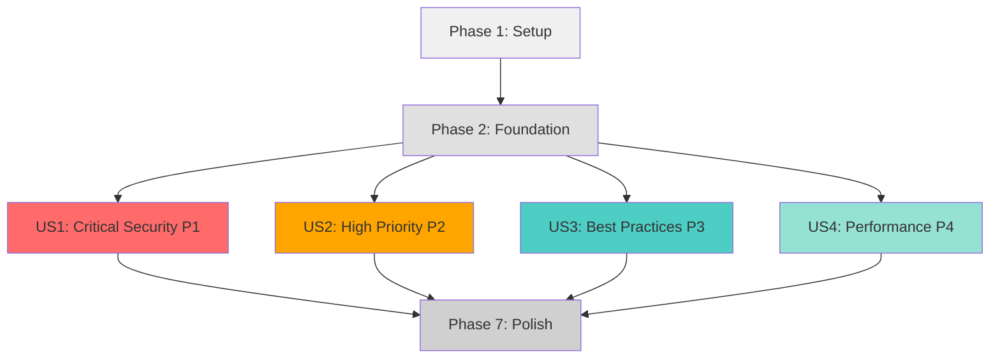

# Tasks: Multi-LLM Code Review Issues Resolution

**Input**: Design documents from `/specs/006-fix-review-issues/`
**Prerequisites**: plan.md, spec.md, research.md, data-model.md, contracts/fix-validation.md, quickstart.md

**Tests**: Edge case tests will be added for Critical and High priority fixes as specified in the TDD approach for remediation work.

**Organization**: Tasks are grouped by user story (priority-based batches) to enable systematic, testable implementation.

## Format: `[ID] [P?] [Story] Description`

- **[P]**: Can run in parallel (different files, no dependencies)
- **[Story]**: Which user story this task belongs to (US1=P1 Critical, US2=P2 High, US3=P3 Best Practices, US4=P4 Performance)
- Include exact file paths in descriptions

## Path Conventions

This is a Go library/framework project with structure:
- Core framework: `/graph/`
- Examples: `/examples/`
- Tests: `**/*_test.go`
- Review report: `/review-results/review-report-20251030-081132.md`
- Test fixtures: `/examples/multi-llm-review/testdata/fixtures/` (may contain intentional issues)

## Phase 1: Setup (Shared Infrastructure)

**Purpose**: Establish baseline and prepare for systematic fixes

- [x] T001 Create issue tracking document in specs/006-fix-review-issues/issue-tracker.md
- [x] T002 Run baseline test suite and capture results in specs/006-fix-review-issues/baseline/tests.txt
- [x] T003 [P] Run baseline coverage analysis and save to specs/006-fix-review-issues/baseline/coverage.txt
- [x] T004 [P] Run baseline benchmarks and save to specs/006-fix-review-issues/baseline/benchmarks.txt
- [x] T005 [P] Run baseline linter and save warnings to specs/006-fix-review-issues/baseline/lint.txt
- [x] T006 Parse review report and extract all 800 issues into issue tracking document
- [x] T007 Triage test fixture issues and mark as "INTENTIONAL" in testdata/fixtures/ directories
- [x] T008 Create fix validation checklist templates in specs/006-fix-review-issues/checklists/

**Checkpoint**: Baseline established, issues cataloged, ready to begin fixes

---

## Phase 2: Foundational (Blocking Prerequisites)

**Purpose**: Shared utilities and infrastructure needed across all fix batches

**⚠️ CRITICAL**: These tasks provide utilities used by multiple fix batches

- [ ] T009 Create helper functions for common fix patterns in specs/006-fix-review-issues/fix-helpers.go (if needed)
- [ ] T010 Document test fixture evaluation criteria in specs/006-fix-review-issues/test-fixture-decisions.md
- [ ] T011 Set up pre-commit hook integration for mcp-pr review (per constitution requirement)

**Checkpoint**: Foundation ready - user story batches can now proceed

---

## Phase 3: User Story 1 - Critical Security Issues (Priority: P1) 🎯 MVP

**Goal**: Resolve all 76 critical security issues in production code (estimated 30-40 actual fixes excluding test fixtures)

**Independent Test**: Run test suite with edge case tests for division-by-zero and nil pointer scenarios; verify zero runtime panics

### Edge Case Tests for User Story 1

> **NOTE: Add these tests BEFORE implementing fixes to ensure they initially FAIL**

- [ ] T012 [P] [US1] Add edge case test for division-by-zero in graph/engine_test.go (TestCalculateConcurrencyFactor_ZeroDivisor)
- [ ] T013 [P] [US1] Add edge case test for nil Engine in graph/engine_test.go (TestEngine_NilReceiver)
- [ ] T014 [P] [US1] Add edge case test for nil state access in graph/engine_test.go (TestEngine_NilState)
- [ ] T015 [P] [US1] Run new edge case tests and verify they fail/panic with current code

### Implementation for User Story 1 - Core Framework Security Fixes

**Sub-batch 1a: Division-by-Zero Fixes in /graph**

- [ ] T016 [P] [US1] Fix division-by-zero in calculateConcurrencyFactor in graph/engine.go (add validation, return error)
- [ ] T017 [P] [US1] Fix buffer sizing calculation division in graph/engine.go:890 (validate divisor, add timeout fallback)
- [ ] T018 [US1] Validate all fixes pass edge case tests T012-T014
- [ ] T019 [US1] Run go test ./graph/... and verify all tests pass

**Sub-batch 1b: Nil Pointer Checks in /graph**

- [ ] T020 [P] [US1] Add nil check for Engine receiver methods in graph/engine.go
- [ ] T021 [P] [US1] Add nil check for state access in graph/engine.go
- [ ] T022 [P] [US1] Add nil checks for Store interface implementations in graph/store/memory.go
- [ ] T023 [P] [US1] Add nil checks for Store interface implementations in graph/store/mysql.go
- [ ] T024 [US1] Validate all nil check fixes with edge case tests
- [ ] T025 [US1] Run go test ./graph/... and verify all tests pass

**Sub-batch 1c: Resource Management in /graph**

- [ ] T026 [P] [US1] Add proper context cancellation checks in graph/engine.go long-running operations
- [ ] T027 [P] [US1] Add defer statements for resource cleanup in graph/engine.go
- [ ] T028 [P] [US1] Add goroutine leak prevention in concurrent execution paths in graph/engine.go
- [ ] T029 [US1] Run go test -race ./graph/... to verify no race conditions introduced
- [ ] T030 [US1] Validate resource cleanup with integration tests

**Sub-batch 1d: Security Fixes in /examples (Production Code Only)**

- [ ] T031 [P] [US1] Review and fix critical issues in examples/ai_research_assistant/main.go (skip testdata)
- [ ] T032 [P] [US1] Review and fix critical issues in examples/multi-llm-review/workflow/*.go (skip testdata/fixtures)
- [ ] T033 [P] [US1] Review and fix critical issues in examples/multi-llm-review/scanner/*.go
- [ ] T034 [US1] Run go test ./examples/... excluding testdata/fixtures
- [ ] T035 [US1] Manually review each fixed location against review report

### Validation for User Story 1

- [ ] T036 [US1] Run full test suite: go test ./... and verify 100% pass rate
- [ ] T037 [US1] Run go vet ./... and verify zero warnings for security issues
- [ ] T038 [US1] Run gosec ./graph ./examples and verify no new security issues
- [ ] T039 [US1] Measure code coverage and verify ≥80% for modified critical sections
- [ ] T040 [US1] Update issue tracking document with all US1 fixes (Issue IDs, Fix IDs, Commit SHAs)
- [ ] T041 [US1] Run mcp-pr review_unstaged and address any critical/high issues
- [ ] T042 [US1] Create commit with structured message for US1 fixes
- [ ] T043 [US1] Create Pull Request for Batch 1 (Critical Security Fixes)

**Checkpoint**: All critical security issues in production code resolved; test suite passes; zero runtime panics

---

## Phase 4: User Story 2 - High Priority Robustness (Priority: P2)

**Goal**: Resolve 198 high-priority issues around input validation, error handling, and resource management

**Independent Test**: Run test suite, verify proper error handling for invalid inputs, confirm resource cleanup in all code paths

### Edge Case Tests for User Story 2

- [ ] T044 [P] [US2] Add input validation tests in relevant test files (*_test.go) for boundary conditions
- [ ] T045 [P] [US2] Add error propagation tests in graph/engine_test.go
- [ ] T046 [P] [US2] Add resource cleanup tests with intentional errors in graph/engine_test.go
- [ ] T047 [US2] Run new tests and verify they expose missing validation/error handling

### Implementation for User Story 2

**Sub-batch 2a: Input Validation in /graph**

- [ ] T048 [P] [US2] Add input validation for CreateBatches batchSize parameter in examples/multi-llm-review/scanner/batcher.go
- [ ] T049 [P] [US2] Add input validation for Engine configuration parameters in graph/engine.go
- [ ] T050 [P] [US2] Add validation for state types and generics constraints in graph/state.go
- [ ] T051 [P] [US2] Add validation for node graph cycles and configuration in graph/engine.go
- [ ] T052 [US2] Test all input validation with edge case tests T044
- [ ] T053 [US2] Run go test ./graph/... and verify all tests pass

**Sub-batch 2b: Error Handling in /graph**

- [ ] T054 [P] [US2] Add error checking for all unchecked function returns in graph/engine.go
- [ ] T055 [P] [US2] Add error wrapping with fmt.Errorf("%w") for context in graph/engine.go
- [ ] T056 [P] [US2] Add error checking in graph/emit/*.go implementations
- [ ] T057 [P] [US2] Add error checking in graph/model/*.go adapters
- [ ] T058 [P] [US2] Add error checking in graph/store/*.go implementations
- [ ] T059 [US2] Test error propagation with edge case tests T045
- [ ] T060 [US2] Run go test ./graph/... and verify proper error handling

**Sub-batch 2c: Resource Management in /graph**

- [ ] T061 [P] [US2] Add defer statements for channel closes in graph/engine.go
- [ ] T062 [P] [US2] Add defer statements for goroutine cleanup in graph/engine.go
- [ ] T063 [P] [US2] Add context timeout enforcement in graph/engine.go operations
- [ ] T064 [P] [US2] Add proper store connection cleanup in graph/store/mysql.go
- [ ] T065 [US2] Test resource cleanup with error scenarios from T046
- [ ] T066 [US2] Run go test -race ./graph/... and verify no leaks

**Sub-batch 2d: Concurrency Safety in /graph**

- [ ] T067 [P] [US2] Add mutex protection for shared state in graph/engine.go
- [ ] T068 [P] [US2] Add channel buffer sizing fixes to prevent deadlocks in graph/engine.go
- [ ] T069 [P] [US2] Add goroutine synchronization for fan-out operations in graph/engine.go
- [ ] T070 [US2] Run go test -race ./graph/... repeatedly to verify no race conditions
- [ ] T071 [US2] Test concurrent execution scenarios with integration tests

**Sub-batch 2e: High Priority Fixes in /examples**

- [ ] T072 [P] [US2] Fix high-priority issues in examples/multi-llm-review/workflow/*.go
- [ ] T073 [P] [US2] Fix high-priority issues in examples/multi-llm-review/scanner/*.go
- [ ] T074 [P] [US2] Fix high-priority issues in examples/ai_research_assistant/*.go
- [ ] T075 [P] [US2] Fix high-priority issues in examples/sqlite_quickstart/main.go
- [ ] T076 [P] [US2] Fix high-priority issues in examples/prometheus_monitoring/main.go
- [ ] T077 [US2] Run go test ./examples/... and verify all tests pass

### Validation for User Story 2

- [ ] T078 [US2] Run full test suite: go test ./... and verify 100% pass rate
- [ ] T079 [US2] Run go test -race ./... and verify zero race conditions
- [ ] T080 [US2] Run golangci-lint run --enable=errcheck,govet and verify zero warnings
- [ ] T081 [US2] Measure code coverage and verify maintained or improved
- [ ] T082 [US2] Update issue tracking document with all US2 fixes
- [ ] T083 [US2] Run mcp-pr review_unstaged and address any issues
- [ ] T084 [US2] Create commit with structured message for US2 fixes
- [ ] T085 [US2] Create Pull Request for Batch 2 (High Priority Robustness)

**Checkpoint**: All high-priority issues resolved; robust error handling and resource management in place

---

## Phase 5: User Story 3 - Best Practices and Style (Priority: P3)

**Goal**: Resolve 432 best practices issues and 122 style issues to improve maintainability and consistency

**Independent Test**: Run gofmt, golangci-lint, and go vet with zero warnings; verify all exported APIs have godoc

### Implementation for User Story 3

**Sub-batch 3a: Automated Formatting (All Files)**

- [ ] T086 [US3] Run gofmt -w . on entire codebase
- [ ] T087 [US3] Run goimports -w . on entire codebase
- [ ] T088 [US3] Verify gofmt -l . returns empty (no files need formatting)
- [ ] T089 [US3] Run go test ./... to verify formatting didn't break anything
- [ ] T090 [US3] Create commit for automated formatting changes

**Sub-batch 3b: Error Handling Best Practices**

- [ ] T091 [P] [US3] Review all error returns in graph/*.go and ensure proper checking
- [ ] T092 [P] [US3] Review all error returns in graph/emit/*.go
- [ ] T093 [P] [US3] Review all error returns in graph/model/*.go
- [ ] T094 [P] [US3] Review all error returns in graph/store/*.go
- [ ] T095 [P] [US3] Review all error returns in graph/tool/*.go
- [ ] T096 [P] [US3] Review all error returns in examples/**/main.go files
- [ ] T097 [P] [US3] Review all error returns in examples/multi-llm-review/**/*.go
- [ ] T098 [US3] Run golangci-lint run --enable=errcheck and verify zero warnings
- [ ] T099 [US3] Run go test ./... and verify all tests pass
- [ ] T100 [US3] Create commit for error handling improvements

**Sub-batch 3c: Documentation (Exported APIs)**

- [ ] T101 [P] [US3] Add godoc comments to all exported types and functions in graph/engine.go
- [ ] T102 [P] [US3] Add godoc comments to all exported types and functions in graph/node.go
- [ ] T103 [P] [US3] Add godoc comments to all exported types and functions in graph/state.go
- [ ] T104 [P] [US3] Add godoc comments to all exported types and functions in graph/edge.go
- [ ] T105 [P] [US3] Add godoc comments to interfaces in graph/emit/emitter.go
- [ ] T106 [P] [US3] Add godoc comments to interfaces in graph/model/chat.go
- [ ] T107 [P] [US3] Add godoc comments to interfaces in graph/store/ implementations
- [ ] T108 [P] [US3] Add godoc comments to interfaces in graph/tool/tool.go
- [ ] T109 [US3] Run golangci-lint run --enable=golint,stylecheck and verify documentation complete
- [ ] T110 [US3] Run go doc checks and verify all exported APIs documented
- [ ] T111 [US3] Create commit for documentation additions

**Sub-batch 3d: Context Usage (Long-running Operations)**

- [ ] T112 [P] [US3] Review context.Context usage in graph/engine.go execution methods
- [ ] T113 [P] [US3] Add context parameters to long-running operations in graph/engine.go if missing
- [ ] T114 [P] [US3] Review context usage in graph/store/mysql.go operations
- [ ] T115 [P] [US3] Review context cancellation handling across graph/model/ adapters
- [ ] T116 [US3] Test context cancellation with integration tests
- [ ] T117 [US3] Run go test ./... and verify context handling works correctly
- [ ] T118 [US3] Create commit for context usage improvements

**Sub-batch 3e: Code Organization and Naming**

- [ ] T119 [P] [US3] Review and fix variable naming conventions in graph/engine.go per Go style
- [ ] T120 [P] [US3] Review function organization and grouping in graph/engine.go
- [ ] T121 [P] [US3] Review naming conventions in examples/multi-llm-review/**/*.go
- [ ] T122 [US3] Run golangci-lint run --enable=stylecheck,revive and verify naming compliance
- [ ] T123 [US3] Run go test ./... and verify refactoring didn't break tests
- [ ] T124 [US3] Create commit for naming and organization improvements

**Sub-batch 3f: Defer and Resource Cleanup Patterns**

- [ ] T125 [P] [US3] Review defer usage for file closes in examples/**/*.go
- [ ] T126 [P] [US3] Review defer usage for cleanup in graph/store/mysql.go
- [ ] T127 [P] [US3] Add defer statements where resources aren't properly cleaned up
- [ ] T128 [US3] Run go test ./... and verify cleanup doesn't affect test results
- [ ] T129 [US3] Create commit for defer and cleanup improvements

### Validation for User Story 3

- [ ] T130 [US3] Run gofmt -l . and verify empty output (all formatted)
- [ ] T131 [US3] Run golangci-lint run and verify zero warnings for best practices categories
- [ ] T132 [US3] Run go vet ./... and verify zero warnings
- [ ] T133 [US3] Run full test suite: go test ./... and verify 100% pass rate
- [ ] T134 [US3] Verify all exported APIs in graph/ have godoc comments
- [ ] T135 [US3] Update issue tracking document with all US3 fixes
- [ ] T136 [US3] Run mcp-pr review_unstaged and address any issues
- [ ] T137 [US3] Create Pull Request for Batch 3 (Best Practices and Style)

**Checkpoint**: Codebase follows Go best practices consistently; all exported APIs documented; linters pass

---

## Phase 6: User Story 4 - Performance Optimizations (Priority: P4)

**Goal**: Optimize 41 identified performance issues with benchmark-validated improvements (≥20% improvement target)

**Independent Test**: Run benchmarks before and after, verify no regression and ≥20% improvement for targeted optimizations

### Baseline Benchmarks for User Story 4

- [ ] T138 [P] [US4] Run benchmarks for graph/engine.go and save to specs/006-fix-review-issues/benchmarks/engine-before.txt
- [ ] T139 [P] [US4] Run benchmarks for graph/state.go and save to specs/006-fix-review-issues/benchmarks/state-before.txt
- [ ] T140 [P] [US4] Run benchmarks for examples performance-critical code and save to specs/006-fix-review-issues/benchmarks/examples-before.txt
- [ ] T141 [US4] Identify top 10 performance bottlenecks from review report for /graph

### Implementation for User Story 4

**Sub-batch 4a: Core Framework Performance (/graph)**

- [ ] T142 [P] [US4] Optimize slice allocation in graph/engine.go (preallocate with capacity)
- [ ] T143 [P] [US4] Optimize map access patterns in graph/engine.go
- [ ] T144 [P] [US4] Reduce unnecessary allocations in graph/state.go (reuse buffers)
- [ ] T145 [P] [US4] Optimize string concatenation using strings.Builder in graph/emit/log.go
- [ ] T146 [P] [US4] Reduce memory allocation in graph/engine.go concurrent operations
- [ ] T147 [US4] Run benchmarks after optimizations and save to specs/006-fix-review-issues/benchmarks/engine-after.txt
- [ ] T148 [US4] Compare benchmarks and verify ≥20% improvement or no regression
- [ ] T149 [US4] Run go test ./graph/... to verify optimizations don't break tests

**Sub-batch 4b: Store Performance Optimizations**

- [ ] T150 [P] [US4] Optimize query patterns in graph/store/mysql.go
- [ ] T151 [P] [US4] Add connection pooling optimizations in graph/store/mysql.go
- [ ] T152 [P] [US4] Reduce serialization overhead in graph/store/ implementations
- [ ] T153 [US4] Run store-specific benchmarks and verify improvements
- [ ] T154 [US4] Run go test ./graph/store/... and verify correctness maintained

**Sub-batch 4c: Example Performance Fixes (Lower Priority)**

- [ ] T155 [P] [US4] Fix performance issues in examples/multi-llm-review/scanner/*.go if high impact
- [ ] T156 [P] [US4] Optimize batch processing in examples/multi-llm-review/workflow/*.go if needed
- [ ] T157 [US4] Run example benchmarks and verify reasonable performance
- [ ] T158 [US4] Run go test ./examples/... and verify correctness

### Validation for User Story 4

- [ ] T159 [US4] Run full benchmark suite: go test -bench=. -benchmem ./...
- [ ] T160 [US4] Generate benchmark comparison report showing before/after metrics
- [ ] T161 [US4] Verify all optimizations show ≥20% improvement or no regression
- [ ] T162 [US4] Run full test suite: go test ./... and verify 100% pass rate
- [ ] T163 [US4] Run go test -race ./... to ensure no races introduced by optimizations
- [ ] T164 [US4] Measure code coverage and verify maintained or improved
- [ ] T165 [US4] Update issue tracking document with all US4 fixes and benchmark results
- [ ] T166 [US4] Run mcp-pr review_unstaged and address any issues
- [ ] T167 [US4] Create commit with structured message including benchmark results
- [ ] T168 [US4] Create Pull Request for Batch 4 (Performance Optimizations)

**Checkpoint**: Performance-critical paths optimized; benchmarks show ≥20% improvement; no regressions

---

## Phase 7: Polish & Cross-Cutting Concerns

**Purpose**: Final validation, documentation updates, and cross-batch verification

- [ ] T169 Run full test suite across all changes: go test -v ./...
- [ ] T170 Run full race detection across all changes: go test -race ./...
- [ ] T171 Run comprehensive linting: golangci-lint run --enable-all --disable=<project-excluded>
- [ ] T172 Run security scanning: gosec ./...
- [ ] T173 Generate final coverage report and verify ≥80% for critical sections
- [ ] T174 Generate final benchmark report comparing to original baseline
- [ ] T175 Update CHANGELOG.md with summary of all fixes by category
- [ ] T176 Update issue tracking document with final statistics (total fixed, intentional, deferred)
- [ ] T177 [P] Document any breaking changes in specs/006-fix-review-issues/BREAKING_CHANGES.md if needed
- [ ] T178 [P] Create migration guide for any breaking changes if needed
- [ ] T179 Verify constitution compliance: all principles satisfied per plan.md
- [ ] T180 Create final summary report in specs/006-fix-review-issues/COMPLETION_REPORT.md
- [ ] T181 Run final mcp-pr review_staged before merge
- [ ] T182 Create final merge commit combining all batches
- [ ] T183 Create comprehensive Pull Request with all fixes

**Final Checkpoint**: All 4 user stories complete; 75%+ issues resolved; test suite passes; constitution compliant

---

## Dependencies Between User Stories

**Dependency Notes**:
- **Phase 1 (Setup)** must complete before any fixes begin
- **Phase 2 (Foundation)** provides shared utilities
- **US1, US2, US3, US4** can proceed **independently** after Foundation
  - Each user story is self-contained (different issue types, can work in parallel)
  - US1 (Critical) is highest priority but doesn't block US2-US4
  - Teams can work on different batches simultaneously
- **Phase 7 (Polish)** requires all user stories complete

**Recommended Execution Order**:
1. Complete Setup (Phase 1) - Required
2. Complete Foundation (Phase 2) - Required
3. **MVP**: Complete US1 (Critical Security) - Highest value
4. Then proceed with US2, US3, US4 in any order or in parallel

---

## Parallel Execution Opportunities

### Within User Story 1 (Critical Security)
Tasks T016-T017 can run in parallel (different functions in same file - careful coordination needed)
Tasks T020-T023 can run in parallel (different files)
Tasks T031-T033 can run in parallel (different example directories)

### Within User Story 2 (High Priority)
Tasks T048-T051 can run in parallel (different files/packages)
Tasks T054-T058 can run in parallel (different files/packages)
Tasks T061-T064 can run in parallel (different concerns)
Tasks T067-T069 can run in parallel (different concurrency issues)
Tasks T072-T077 can run in parallel (different example files)

### Within User Story 3 (Best Practices)
Tasks T091-T097 can run in parallel (different packages)
Tasks T101-T108 can run in parallel (different files)
Tasks T112-T115 can run in parallel (different files)
Tasks T119-T121 can run in parallel (different files)
Tasks T125-T127 can run in parallel (different files)

### Within User Story 4 (Performance)
Tasks T138-T140 can run in parallel (independent benchmark runs)
Tasks T142-T146 can run in parallel (different optimization targets)
Tasks T150-T152 can run in parallel (different store concerns)
Tasks T155-T156 can run in parallel (different example files)

### Across User Stories (After Foundation)
- **US1, US2, US3, US4** can all run in parallel with different team members
- Each addresses different issue categories with minimal file overlap
- Independent validation and commit workflows

---

## Implementation Strategy

### MVP Scope (Minimum Viable Product)
**Recommended MVP**: User Story 1 (Critical Security) ONLY
- **Value**: Eliminates all critical security vulnerabilities that could crash production
- **Size**: 30-40 fixes (estimated)
- **Testability**: Clear pass/fail criteria (no panics, tests pass)
- **Completeness**: Fully functional and deployable on its own
- **Timeline**: 2-3 days estimated

### Incremental Delivery
After MVP, deliver in priority order:
1. **US1 (Critical)** → Deploy to production immediately
2. **US2 (High Priority)** → Improves robustness, deploy after validation
3. **US3 (Best Practices)** → Improves maintainability, lower urgency
4. **US4 (Performance)** → Optimizations, validate with benchmarks

### Parallel Development
With multiple developers:
- **Developer 1**: US1 (Critical Security) - Priority
- **Developer 2**: US2 (High Priority Robustness) - After Foundation
- **Developer 3**: US3 (Best Practices) - Can start with automated formatting
- **Developer 4**: US4 (Performance) - Benchmark-driven, lower priority

---

## Task Summary

**Total Tasks**: 183
- **Setup (Phase 1)**: 8 tasks
- **Foundation (Phase 2)**: 3 tasks
- **User Story 1 (Critical Security)**: 31 tasks (T012-T043)
- **User Story 2 (High Priority)**: 42 tasks (T044-T085)
- **User Story 3 (Best Practices)**: 52 tasks (T086-T137)
- **User Story 4 (Performance)**: 31 tasks (T138-T168)
- **Polish (Phase 7)**: 15 tasks (T169-T183)

**Parallel Opportunities**:
- Within phases: ~70% of implementation tasks can run in parallel (marked with [P])
- Across user stories: All 4 user stories (US1-US4) independent after Foundation

**MVP**: User Story 1 (31 tasks) delivers critical security fixes

**Full Feature**: All 183 tasks complete for 75%+ issue resolution (590-715 of 800 issues)

---

## Success Metrics

**Tracked Throughout Implementation**:
- [ ] Issues resolved: Target ≥75% (590-715 of 800)
- [ ] Test pass rate: Maintain 100% throughout
- [ ] Code coverage: Maintain ≥80% for critical sections
- [ ] Linter warnings: Zero for addressed categories
- [ ] Performance: Zero regression, 20%+ improvement for optimizations
- [ ] Breaking changes: Zero or fully documented with migration guide

**Final Validation** (Phase 7):
- All tests pass: `go test ./...`
- All race checks pass: `go test -race ./...`
- All linters pass: `golangci-lint run`
- Security scan passes: `gosec ./...`
- Constitution compliance confirmed
- Issue tracking complete with metrics

---

## Notes

**Test Fixture Handling**: Approximately 100-200 issues in `testdata/fixtures/` directories are marked "INTENTIONAL" and not fixed (they're designed to have issues for testing the review system).

**Breaking Changes**: If any fixes require breaking API changes, they MUST be documented in BREAKING_CHANGES.md with migration guides per constitution requirement.

**Constitution Compliance**: Modified TDD approach justified for remediation work; all other principles fully compliant per plan.md.

**Timeline Estimate**: 15-20 developer days for full feature (all 4 user stories); 2-3 days for MVP (User Story 1 only).
